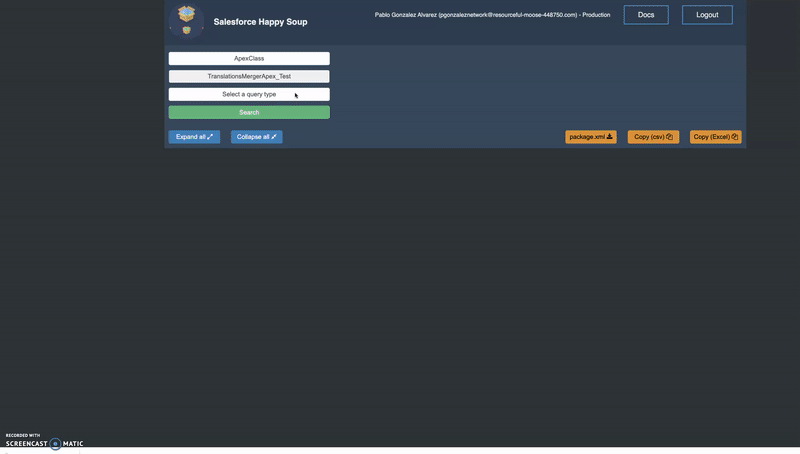

# Salesforce Happy Soup
## The best way to visualize your Salesforce dependencies

[Salesforce Happy Soup](https://sfdc-happy-soup.herokuapp.com/) is a **100% free** and open source heroku app that you can use to get a full view of your Salesforce org dependencies. 

[Watch a quick demo, you willl start using it!](http://github.com) 

No complex sfdx commands :x:                  

No installation :x:                          

No **development knowledge** required :x:  

Just [log in](https://sfdc-happy-soup.herokuapp.com/) and start sipping the soup! :stew: :clap: :white_check_mark:

  

## Contents

* [The best feature - Deployment Boundaries](#the-best-feature---deployment-boundaries)
* [Who is this for](#question-who-is-this-for)
* [Features](#thumbsup-features)
* [Security](#no_entry_sign-security)
* [How we enhaced the MetadataComponentDependency API](#how-we-enhaced-the-metadatacomponentdependency-api)
* [Best Practices for Deployment Boundaries](#best-practices-for-deployment-boundaries)
* [One-click deployment to your own Heroku account](#best-practices-for-deployment-boundaries)
* [Local installation](#best-practices-for-deployment-boundaries)
* [Build your own apps using the core npm library](#best-practices-for-deployment-boundaries)

## The best feature - Deployment Boundaries

Jump to the the [Who is this for](#question-who-is-this-for) for section to see how **:star:admins and developers:star:** can also use this app. 

#### Why Salesforce DX has seen poor adoption :disappointed:

Salesforce DX introduced the idea of breaking down your org into packages with discrete and modular functionality. 

Unfortunately, the actual steps do that are very complicated and has led to poor adoption of scratch orgs and unlocked packages. With this realization, Salesforce released the Metadata Dependencies API (`MetadataComponentDependency`), which allows you to see where your metadata is used or what it uses.

#### The real problem :thumbsdown:

It's **not enough** to see where an apex class is used, or what it uses. To be able to take a group of metadata and convert it into an unlocked package/scratch org, you need to be able to answer the question:

> *What is all the metadata that I need to deploy this to a brand new, empty org?*

Say for example you have a complex visualforce page that you are considering for an unlocked page. How do you know what is needed to deploy this to a new org? You can use the new Dependency API to see what that visualforce page references, mainly the controller.

But what about what the controller itself references? Surely it references fields and perhaps other classes. What if some of those fields are cross-object formula fields? This would mean that those objects in the lookup field are also required to be able to deploy this visualforce page to a new org.

What if the controller uses a helper class that itself depends on custom metadata?

You could spend all day running queries through the API! :weary:

#### How Salesforce happy soup can help you :white_check_mark:

To answer to this problem is that you have to recursively query metadata dependencies until you get to the very last metadata member needed to the deploy the top level component. This is what we call a ***Deployment Boundary*** :bulb:

> *A Deployment Boundary represents all the metadata that needs to exist in another org before you can deploy a specific component*

This is **not a trivial thing to do** but Salesforce Happy Soup does it for you with one click. :heart_eyes:

When you use the Deployment Boundary feature, the app will give you all the metadata that is needed to be able to deploy that component. You can then export this data in either an excel/csv or package.xml format (in which case you can immediately retrieve it from your org and package it!).

## Who is this for

**Administrators** 

* Find all the metadata used in page layout (fields, buttons, inline pages, etc) and export it to excel to review opportunities for optimization.
* Don't break your org! Know the impact of making changes to a field, validation rule, etc 

**Developers & Architects**

* Discover **deployment boundaries** that can be the baseline for a scratch org or unlocked packages
* Quickly get a package.xml of your deployment boundary
* Get immediately insights with built-in charts
* Drill down to the last dependent metadata in an easy to follow tree structure

## :thumbsup: Features

*  "Where is this used" and "Deployment Boundary" visualization :white_check_mark: 
*  Easily export the dependencies to excel, csv files or package.xml :white_check_mark: 
*  [Bypass all the limitations of the MetadataComponentDependency API](#how-we-enhaced-the-metadatacomponentdependency-api) :white_check_mark: 
*  Intuitive UI, easy to follow tree structure :white_check_mark: 
*  Log in from anywhere, no installation required :white_check_mark: 
*  Available for self-hosting locally or on your own Heroku account :white_check_mark: 

## :no_entry_sign: Security 

We understand security is very important in the Salesforce ecosystem. With that in mind, we want to be fully transparent as to how this app uses your Salesforce data and what security mechanisms are in place.

**API Access**

When you log in to the app, you'll be asked to authorise it to send requests on your behalf using OAuth. Once you grant permission, the app will make the following API calls during its lifecylce:

* `Tooling API` to query `CustomField`, `CustomObject` and `MetadataComponentDependency` records
* `Metadata API` to get describe information on custom fields
* `SOAP API` to validate that the token is still valid and to logout when requested by the user

**Login out or revoking the access token**

If at anytime you want the app to lose access to your access token, you have two options:

* Use the Logout button on the app. This will completely destroy the server side session and all record of your access token. 
* From `Salesforce > Setup > Connected Apps Oauth Usage` > Find the token for Salesforce Happy Soup and revoke it. The app will no longer be able to use the access token and you'll be logged out the moment you try to use the app again. 

**How is your token stored**

Your access token will be temporarily stored in a redis database which is provisioned by Heroku. The token is then retrieved by the server every time you use the app, as long as you have a valid server-side session with the app, and the required cookies.

Access to the database is restricted and the credentials are not stored anywhere in the source code; it is managed via environment variables.

This mechanism is the same way Workbench, OrgDoctor, MavensMate and other open source projects work. Again, if this doesn't meet your security standards, we encourage you to use the app locally or own your own heroku account, no need to miss on all the features we provide! 

**Server-side security**

Every time a request is made to the app, the request goes through the following layers of security:

* Every HTTP request is encrypted with SSL certificates managed by Heroku. 
* We use CORS to validate HTTP requests made from a web browser.
* Once CORS is validated, we check that the request contains a cookie, which is encrypted. The cookie is then used to retrieve a server-side session. If the session does not exist or has expired, the user is sent back to the login page.
* Once the server-side session is verified, we check that the user has a valid session with their Salesforce org. If the user doesn't have a valid session with Salesforce, we send the user back to the login page.

## How we enhaced the MetadataComponentDependency API

Salesforce Happy Soup is built on top of the `MetadataComponentDependency` tooling API. While this API is great, it has huge limitations that make it hard to work with (**spolier**: we bypass all these!)

* Custom field names are returned without the object name and without the _ _ c suffix. For example `Opportunity.Revenue__c` becomes `Revenue`. This makes it very hard to know which fields are actually being referenced. The only way around this is to manually and painfully retrieve additional information through the Tooling and Metadata API.

* Validation rules names are also returned without the object prefix, so `Account.ValidationRule` becomes `ValidationRule`. If you want to export this via package.xml, again you'd have to use other APIs to retrieve this information.

* Objects referenced via a lookup field are not returned. For example, if you have a custom field `Account.RelatedToAnotherObject__c` pointing to `RelatedToAnotherObject__c`, that object is not brought back as a dependency, which is obviously wrong because you can't deploy that custom field to an org where that object doesn't exist. 

* Global Value Sets are not returned when picklist fields depend on them. 

* Lookup filters are returned with cryptic names depending on whether they belong to a custom object or a standard one. 

As said above, Salesforce Happy Soup has **fixed all** this issues so that you can focus on learning about your dependencies rather than fighting the API! :facepunch:

## Best Practices for Deployment Boundaries

When using the Deployment Boundary feature, you should try to identify the top-most, entry point of your application or business process. Some examples:

**LWC Components**

A LWC that allows Sales reps to better manage their pipeline. This controller is likely the entry point, it is where all the other metadata are eventually called or referenced. 

For example, the apex controller will be directly called here, and said controller with then reference other metadata. If you had started looking at the dependecy tree from the apex class, you would've missed certain metadata items that are only referenced by the LWC itself (i.e custom labels, etc).

**Apex Triggers**

Apex triggers are also a good example of an application entry point. For example if you want to create an unlocked package with all your opportunity functionality, creating a Deployment Boundary from the opportunity triggers would give you a good overview (though not everything) of what functionality is used by the opportunity object.

## One-click Installation to your own Heroku Account

You can use the following button to quickly install/deploy the application to your own Heroku Account 

This is by far the easiest way to use the app on your own servers so that you don't have to worry about security.

When you click the button and log in to your Heroku account, you'll see a page similar to the following:

  

