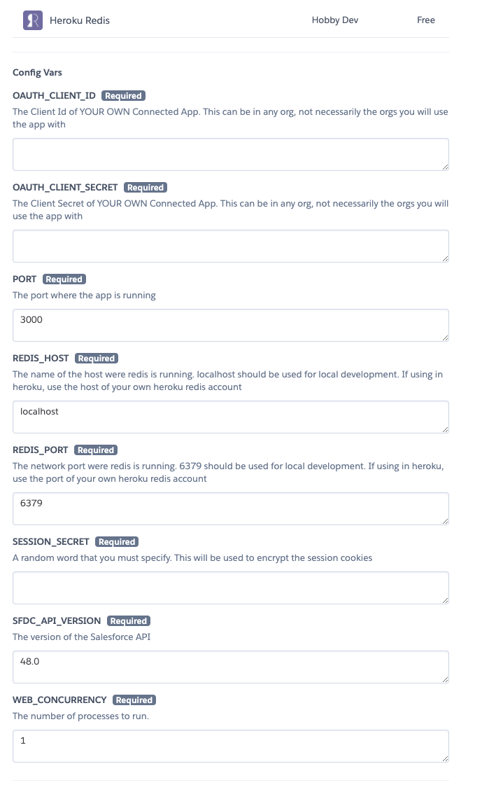
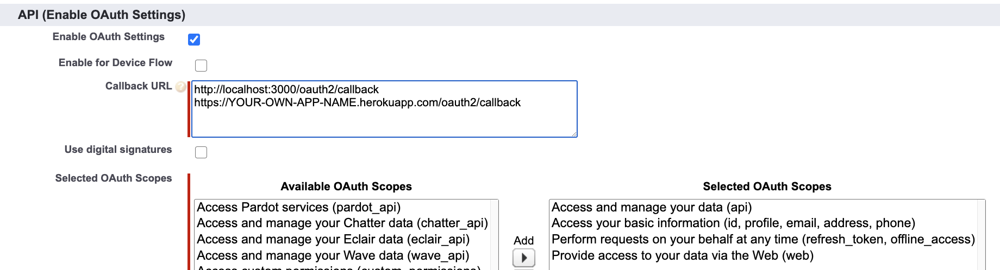
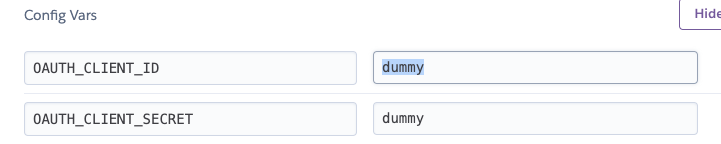

# Salesforce Happy Soup
## The best way to visualize your Salesforce dependencies

<div style="margin-bottom:10px">
  <a href="https://heroku.com/deploy?template=https://github.com/pgonzaleznetwork/sfdc-happy-soup/tree/master" target="_blank">
    
  </a>
</div>


[Salesforce Happy Soup](https://sfdc-happy-soup.herokuapp.com/) is a **100% free** and open source heroku app that you can use to get a full view of your Salesforce org dependencies. 

[Start using it!](https://sfdc-happy-soup.herokuapp.com/)

No complex sfdx commands :x:                  

No installation :x:                          

No **development knowledge** required :x:  

Just [log in](https://sfdc-happy-soup.herokuapp.com/) and start sipping the soup! :stew: :clap: :white_check_mark:


<p align="center">
  
</p>

[Watch full demo](https://www.youtube.com/watch?v=NH4LGbdYaaE) 

## Contents

* [What is a Happy Soup?](#what-is-a-happy-soup)
* [Who is this for](#question-who-is-this-for)
* [Deployment Boundaries](#deployment-boundaries)
* [Impact Analysis](#impact-analysis)
* [Features](#thumbsup-features)
* [Security](#no_entry_sign-security)
* [How we enhaced the MetadataComponentDependency API](#how-we-enhaced-the-metadatacomponentdependency-api)
* [Best Practices for Deployment Boundaries](#best-practices-for-deployment-boundaries)
* [One-click deployment to your own Heroku account](#one-click-deployment-to-your-own-heroku-account)
* [Local deployment](#local-deployment)
* [Build your own apps using the core npm library](#Build-your-own-apps-using-the-core-npm-library)

## What is a Happy Soup?

> *As a long-time customer, you’ve built apps and customizations on the platform for several releases. The more you customize and build on the platform, the more complexity you create in your org. Your single Salesforce org has become a huge container for all the metadata you’re managing and interacting with. We refer to this horn of plenty as your “happy soup.”* **[Trailhead](https://trailhead.salesforce.com/content/learn/modules/unlocked-packages-for-customers/break-up-your-metadata)**

## Who is this for

**Developers & Architects**

* Discover [Deployment Boundaries](#deployment-boundaries) that can be the baseline for a scratch org or unlocked packages
* Quickly get a package.xml of your deployment boundary
* Get immediately insights with built-in charts
* Drill down to the last dependent metadata in an easy to follow tree structure

**Administrators** 

* Find all the metadata used in page layout (fields, buttons, inline pages, etc) and export it to excel to review opportunities for optimization
* Don't break your org! Know the impact of making changes to a field, validation rule, etc 


## Deployment Boundaries

#### Why Scratch Orgs and Unlocked Packages have seen adoption :disappointed:

Salesforce DX introduced the idea of breaking down your org into packages with discrete and modular functionality. Anyone trying to buy into this idea is faced with the following challenges:

> * How do you know what metadata can be grouped into a package?
> * How do you tell what that metadata depends on?
> * How do you know what metadata is required for a feature to exist?

Unfortunately, Salesforce DX doesn't provide an answer to these challenges, and it would take most organizations years to be able to split their org in this way.

This has led to poor adoption of scratch orgs and unlocked packages. 


With this realization, Salesforce released the Metadata Dependencies API (`MetadataComponentDependency`), which allows you to see where your metadata is used or what it uses.

#### The real problem :thumbsdown:

So with the new API now organizations can "easily" see where their metadata is used and start their journey to unlocked packages. **This is an oversimplification** . 

It's **not enough** to see where an apex class is used, or what it uses. To be able to take a group of metadata and convert it into an unlocked package/scratch org, you need to be able to answer the question:

> *What is all the metadata that I need to deploy this to a brand new, empty org?*

Say for example you have a complex visualforce page that you are considering for an unlocked page. How do you know what is needed to deploy this to a new org? You can use the new Dependency API to see what that visualforce page references, mainly the controller.

But what about what the controller itself references? Surely it references fields and perhaps other classes. What if some of those fields are cross-object formula fields? This would mean that those objects in the lookup field are also required to be able to deploy this visualforce page to a new org.

What if the controller uses a helper class that itself depends on custom metadata?

You could spend all day running queries through the API! :weary:

#### How Salesforce happy soup can help you :white_check_mark:

To answer to this problem is that you have to recursively query metadata dependencies until you get to the very last metadata member needed to the deploy the top level component. This is what we call a ***Deployment Boundary*** :bulb:

> *A Deployment Boundary represents all the metadata that needs to exist in another org before you can deploy a specific component*

This is **not a trivial thing to do** but Salesforce Happy Soup does it for you with one click. :heart_eyes:

When you use the Deployment Boundary feature, the app will give you all the metadata that is needed to be able to deploy that component. You can then export this data in either an excel/csv or package.xml format (in which case you can immediately retrieve it from your org and package it!).

[Back to top](#salesforce-happy-soup)

## Impact Analysis

The Impact Analysis feature allows to see most of the places where a given metadata is used. 

A common requirement Salesforce customers have is to know where a custom field is used to understand the implications of making changes to that field.

For example, changing a picklist value or changing a field type could have side-effects on:

* Reports
* Report Types
* Email Templates
* Aura/LWC Components
* Apex classes
* etc

Don't break your org! Use the Impact Analysis feature before making any changes so that you are fully aware of what areas could be impacted.


[Back to top](#salesforce-happy-soup)

## :thumbsup: Features

*  "Where is this used" and "Deployment Boundary" visualization :white_check_mark: 
*  Easily export the dependencies to excel, csv files or package.xml :white_check_mark: 
*  [Bypass all the limitations of the MetadataComponentDependency API](#how-we-enhaced-the-metadatacomponentdependency-api) :white_check_mark: 
*  Intuitive UI, easy to follow tree structure :white_check_mark: 
*  Log in from anywhere, no installation required :white_check_mark: 
*  Available for self-hosting locally or on your own Heroku account :white_check_mark: 

[Back to top](#salesforce-happy-soup)

## :no_entry_sign: Security 

We understand security is very important in the Salesforce ecosystem. With that in mind, we want to be fully transparent as to how this app uses your Salesforce data and what security mechanisms are in place.

>  Remember that you can always [deploy the app to your own Heroku account](#one-click-deployment-to-your-own-heroku-account) or use it [locally](#local-deployment), in which case you need need to worry about security!

**API Access**

When you log in to the app, you'll be asked to authorise it to send requests on your behalf using OAuth. Once you grant permission, the app will make the following API calls during its lifecylce:

* `Tooling API` to query `CustomField`, `CustomObject` and `MetadataComponentDependency` records
* `Metadata API` to get describe information on custom fields
* `SOAP API` to validate that the token is still valid and to logout when requested by the user

**Login out or revoking the access token**

If at anytime you want the app to lose access to your access token, you have two options:

* Use the Logout button on the app. This will completely destroy the server side session and all record of your access token. 
* From `Salesforce > Setup > Connected Apps Oauth Usage` > Find the token for Salesforce Happy Soup and revoke it. The app will no longer be able to use the access token and you'll be logged out the moment you try to use the app again. 

**How is your token stored**

Your access token will be temporarily stored in a redis database which is provisioned by Heroku. The token is then retrieved by the server every time you use the app, as long as you have a valid server-side session with the app, and the required cookies.

Access to the database is restricted and the credentials are not stored anywhere in the source code; it is managed via environment variables.

This mechanism is the same way Workbench, OrgDoctor, MavensMate and other open source projects work. 

**Server-side security**

Every time a request is made to the app, the request goes through the following layers of security:

* Every HTTP request is encrypted with SSL certificates managed by Heroku. 
* We use CORS to validate HTTP requests made from a web browser.
* Once CORS is validated, we check that the request contains a cookie, which is encrypted. The cookie is then used to retrieve a server-side session. If the session does not exist or has expired, the user is sent back to the login page.
* Once the server-side session is verified, we check that the user has a valid session with their Salesforce org. If the user doesn't have a valid session with Salesforce, we send the user back to the login page.

[Back to top](#salesforce-happy-soup)

## How we enhaced the MetadataComponentDependency API

Salesforce Happy Soup is built on top of the `MetadataComponentDependency` tooling API. While this API is great, it has huge limitations that make it hard to work with (**spolier**: we bypass all these!)

* Custom field names are returned without the object name and without the _ _ c suffix. For example `Opportunity.Revenue__c` becomes `Revenue`. This makes it very hard to know which fields are actually being referenced. The only way around this is to manually and painfully retrieve additional information through the Tooling and Metadata API.

* Validation rules names are also returned without the object prefix, so `Account.ValidationRule` becomes `ValidationRule`. If you want to export this via package.xml, again you'd have to use other APIs to retrieve this information.

* Objects referenced via a lookup field are not returned. For example, if you have a custom field `Account.RelatedToAnotherObject__c` pointing to `RelatedToAnotherObject__c`, that object is not brought back as a dependency, which is obviously wrong because you can't deploy that custom field to an org where that object doesn't exist. 

* Global Value Sets are not returned when picklist fields depend on them. 

* Lookup filters are returned with cryptic names depending on whether they belong to a custom object or a standard one. 

As said above, Salesforce Happy Soup has **fixed all** this issues so that you can focus on learning about your dependencies rather than fighting the API! :facepunch:

[Back to top](#salesforce-happy-soup)

## Best Practices for Deployment Boundaries

When using the Deployment Boundary feature, you should try to identify the top-most, entry point of your application or business process. Some examples:

**LWC Components**

A LWC that allows Sales reps to better manage their pipeline. This controller is likely the entry point, it is where all the other metadata are eventually called or referenced. 

For example, the apex controller will be directly called here, and said controller with then reference other metadata. If you had started looking at the dependecy tree from the apex class, you would've missed certain metadata items that are only referenced by the LWC itself (i.e custom labels, etc).

**Apex Triggers**

Apex triggers are also a good example of an application entry point. For example if you want to create an unlocked package with all your opportunity functionality, creating a Deployment Boundary from the opportunity triggers would give you a good overview (though not everything) of what functionality is used by the opportunity object.

[Back to top](#salesforce-happy-soup)

## One-click Deployment to your own Heroku Account

You can use the following button to quickly install/deploy the application to your own Heroku Account 

<a href="https://heroku.com/deploy?template=https://github.com/pgonzaleznetwork/sfdc-happy-soup/tree/master">
  
</a>

This is by far the easiest way to use the app on your own servers so that you don't have to worry about security.

When you click the button and log in to your Heroku account, you'll see a page similar to the following:

<p align="center">
  
</p>

To get started, add dummy values on all the empty Config Vars, we'll come back to change those later.

Once you've added dummy values, just click the **Deploy App** button. Once the app is deployed, you'll be able to launch it and at a minimum, see the login page. Congratulations!!

Now, the steps to get the app fully working are as follows:

**1. Create a Connected App in any org**

For the app to be able to use OAuth tokens, it needs to be connected to a Connected App. The original app uses a Connected App that lives in one of our orgs; for your own app you can then use a Connected App in any org as well - We recommend using a dev org.

The OAuth configuration for the Connected App needs to look like this:

<p align="center">
  
</p>

**It is very important that you change the Callback URL to point to your heroku app domain name, which is the name that you chose when deploying the app**

For example, if your app name is `mycompany-happysoup.herokuapp.com` then the Callback URL must be `mycompany-happysoup.herokuapp.com/oauth2/callback` . You must also add the following URL so that you can run the app locally using the `heroku local` command

`http://localhost:3000/oauth2/callback`

Note that if you changed the default `PORT` environment variable in the deployment page, you need to update the localhost port in the callback URL as well. 

Once you have created the Connected App, get the Client Secret and Client Id; we'll need them in the next step.

**2. Adding OAuth config**

Now that you have the Client Secret and Id, let's add them to the app.

The Client Id needs to be added in the `public/login.js` file, as follows

```js
  let clientId = "YOUR OWN CLIENT ID  GOES HERE";
  let responseType = "code";
        
  let requestURL = `${authEndPoint}?client_id=${clientId}&response_type=${responseType}&redirect_uri=${redirectURI}&state=${state}`;
```

Then, both the Client Secret and Id need to be added as environment variables on the heroku app itself at `https://dashboard.heroku.com/apps/YOUR-APP-NAME > Settings > Reveal Config Vars`

<p align="center">
  
</p>

All the other variables should be configured already, including `REDIS_URL` which is automatically added by Heroku since redis is required to deploy the app.

That's it! Now you can use the app in your own servers.

[Back to top](#salesforce-happy-soup)

## Local Deployment

We don't recommend using the app locally because there are too many variables in your system that may cause the app not to work correctly. Deploying to your own (and also free) heroku account is a lot easier - see the section before this one.

That said, if you really want to use it locally to play around or to submit pull requests, here's a quick overview of what the steps would look like

**NOTE:** Before following any of these steps, you must have a Connected App created in any dev org, see the previous section for the steps.

**1.** Make sure you have NPM and NodeJs installed. 

**2.** Download redis and don't change any of the default configuration. You can use this guide to see how to download it https://redis.io/topics/quickstart
 
**3.** For the github repostory to your own repository. 

**4.** Go to the local repository in your terminal and use the following command

`npm install`

This will install all the required NPM modules for the app to work

**5.** In another terminal, start the redis server using the following command

```
$ redis-server
[28550] 01 Aug 19:29:28 # Warning: no config file specified, using the default config. In order to specify a config file use 'redis-server /path/to/redis.conf'
[28550] 01 Aug 19:29:28 * Server started, Redis version 2.2.12
[28550] 01 Aug 19:29:28 * The server is now ready to accept connections on port 6379
```

If the command doesn't work, make sure you followed **ALL** the steps here https://redis.io/topics/quickstart

**6.** Go back to your main terminal, and download the heroku CLI from here https://devcenter.heroku.com/articles/heroku-cli

**7.** Create a `.env` file in the root directory of the app, here's where we are going to place all the environment variables. The file should look like this

```
OAUTH_CLIENT_ID=YOUR OWN CLIENT ID
OAUTH_CLIENT_SECRET=YOUR OWN CLIENT SECRET
SFDC_API_VERSION=49.0 (ANYTHING BEFORE 48.0 WON'T WORK)
REDIS_HOST=localhost
REDIS_PORT=6379
SESSION_SECRET=YOUR OWN SECRET, ANY STRING
PORT=3000
```

**7.** Once the Heroku CLI is installed, use the following command

`heroku local`

Then you should be able to open the app on localhost:3000. To be able to log in, you must have localhost:3000 as a callback URL in the Connected App (see the previous section for details)

That's it, congratulations!

[Back to top](#salesforce-happy-soup)

## Build your own apps using the core npm library

Salesforce Happy Soup is built on top of the [sfdc-soup](https://github.com/pgonzaleznetwork/sfdc-soup/tree/master) NodeJs library, which is an API that returns an entire salesforce dependency tree in different formats, including JSON, excel and others. 

Head over that its repository to learn how you can create your apps. 

[Back to top](#salesforce-happy-soup)