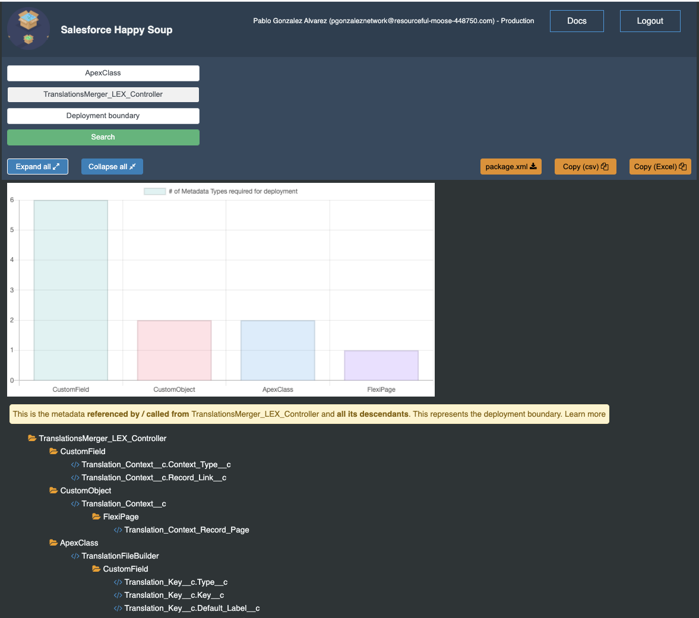

# Salesforce Happy Soup

[Salesforce Happy Soup](https://sfdc-happy-soup.herokuapp.com/) is a **100% free** and open source heroku app that you can use to get a full view of your Salesforce org dependencies. 

[Watch a quick demo, you willl start using it!](http://github.com) 

No complex sfdx commands, plug-ins or development knowledge required :cold_sweat:  just [log in](https://sfdc-happy-soup.herokuapp.com/) and start sipping the soup! :stew: :clap:

  

## The best feature - Deployment Boundaries

Salesforce DX introduced the idea of breaking down your org into packages with discrete and modular functionality. 

Unfortunately, the actual steps do that are very complicated and has led to poor adoption of scratch orgs and unlocked packages. With this realization, Salesforce released the Metadata Dependencies API (MetadataComponentDependency), which allows you to see where your metadata is used or what it uses.

However, it's **not enough** to see where an apex class is used, or what it uses. To be able to take a group of metadata and convert it into an unlocked package/scratch org, you need to be able to answer the question:

*What is all the metadata that I need to deploy this to a brand new empty org?*

## :question: Who is this for

**Administrators** 

 

* Find all the metadata used in page layout (fields, buttons, inline pages, etc) and export it to excel to review opportunities for optimization.
* Know the impact of making changes to a field, validation rule, etc - before you break anything!
* Know where your metadata is used 

**Developers & Architects**

* Discover **deployment boundaries** that can be the baseline for a scratch org or unlocked packages
* Quickly get a package.xml of your deployment boundary
* Get immediately insights with built-in charts
* Drill down to the last dependent metadata in an easy to follow tree structure

## :thumbsup: Features

* :white_check_mark: -   "Where is this used" and "Deployment Boundary" visualization
* :white_check_mark: -   Easily export the dependencies to excel, csv files or package.xml
* :white_check_mark: -   Bypass all the limitations of the MetadataComponentDependency API
* :white_check_mark: -   Intuitive UI, easy to follow tree structure
* :white_check_mark: -   Log in from anywhere, no installation required
* :white_check_mark: -   Available for self-hosting locally or on your own Heroku account

## :no_entry_sign: Security 

We understand security is very important in the Salesforce ecosystem. With that in mind, we want to be fully transparent as to how this app uses your Salesforce data and what security mechanisms are in place.

**API Access**

When you log in to the app, you'll be asked to authorise it to send requests on your behalf using OAuth. Once you grant permission, the app will make the following API calls during its lifecylce:

* Tooling API to query CustomField, CustomObject and MetadataComponentDependency records
* Metadata API to get describe information on custom fields
* SOAP API to validate that the token is still valid and to logout when requested by the user

**Login out or revoking the access token**

If at anytime you want the app to lose access to your access token, you have two options:

* Use the Logout button on the app. This will completely destroy the server side session and all record of your access token. 
* From Salesforce > Setup > Connected Apps Oauth Usage > Find the token for sfdc-happy-soup and revoke it. The app will no longer be able to use the access token and you'll be logged out the moment you try to use the app again. 

**How is your token stored**

Your access token will be temporarily stored in a redis database which is provisioned by Heroku. The token is then retrieved by the server every time you use the app, as long as you have a valid server-side session with the app, and the required cookies.

Access to the database is restricted and the credentials are not stored anywhere in the source code; it is managed via environment variables.

This mechanism is the same way Workbench, OrgDoctor, MavensMate and other open source projects work. Again, if this doesn't meet your security standards, we encourage you to use the app locally or own your own heroku account, no need to miss on all the features we provide! 
